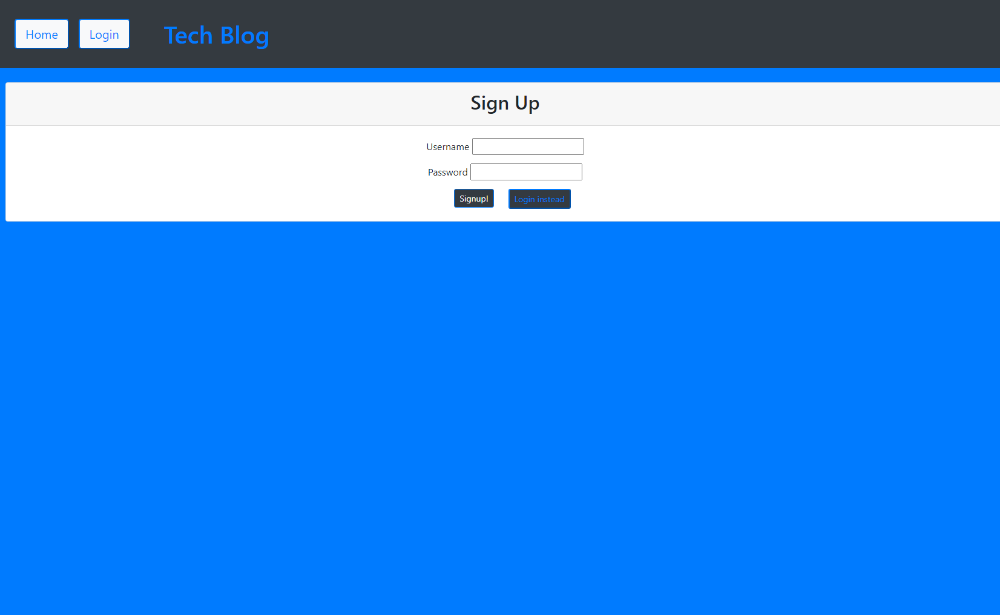
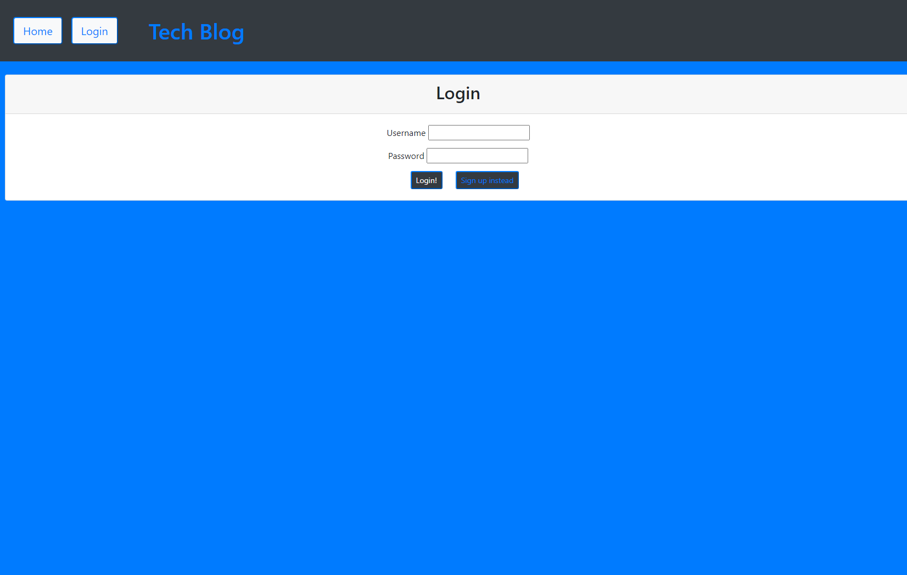
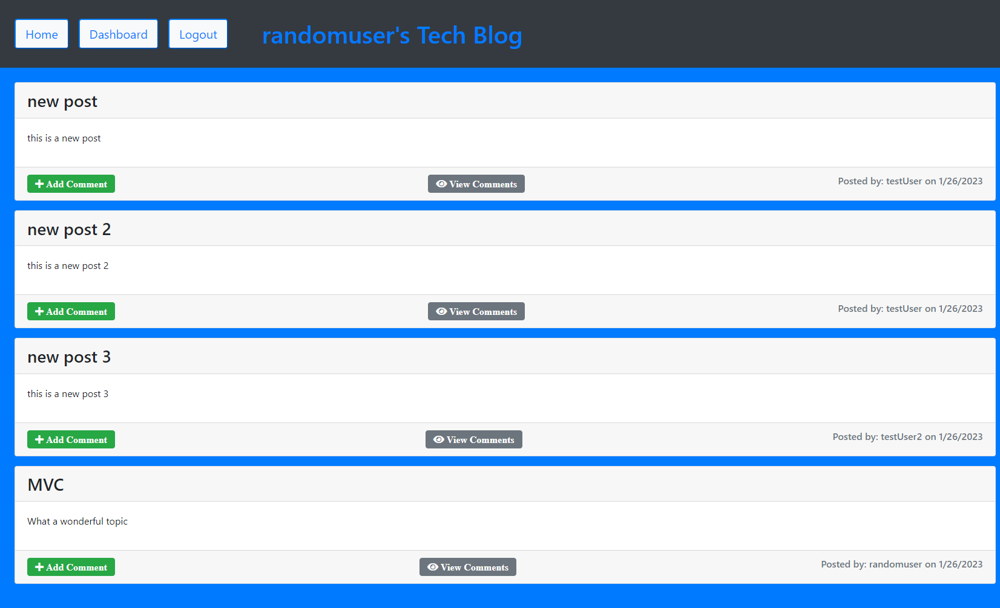
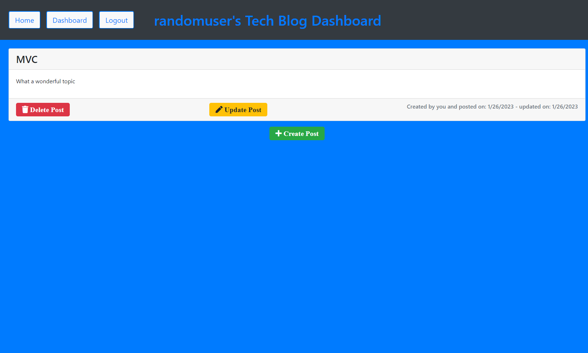
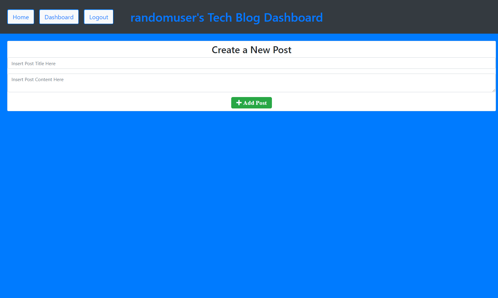
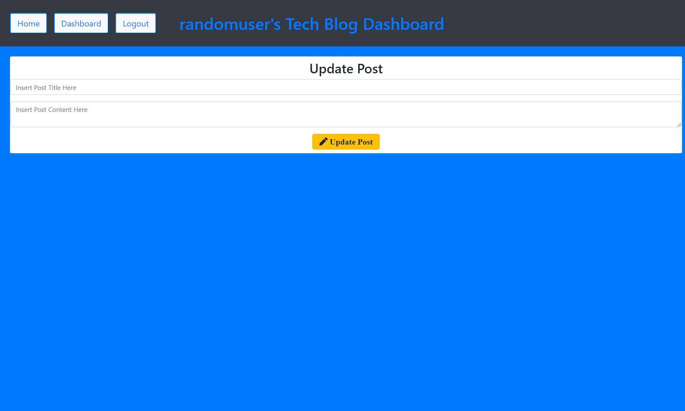
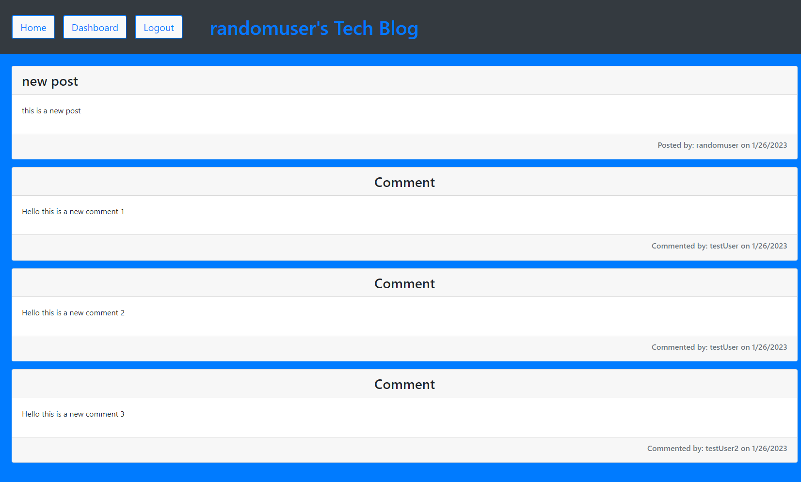
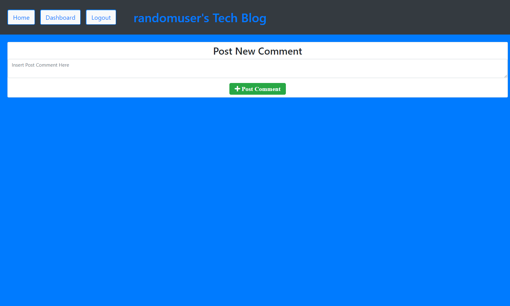

# MVC-Tech-Blog

[Link to my project](https://github.com/Cujion/MVC-Tech-Blog)
[Link to deployed heroku page](https://shielded-lake-01509.herokuapp.com/login)

## Table of Contents
- [Description](#description)
- [Visuals](#visuals)
- [License](#license)

## Description
* This application is a complete front-end and back-end webpage that handles all user input through Model-View-Controllers also known as MVC. This app uses a wide range of node modules along with MySQL to handle all database information, Handlebars in order to change how the webpage view looks and what is being displayed on the page depending on the users input. On startup of this webpage you will be prompted to either login if you have created a user before, if not you can then signup. Once logged in you will be redirected to your user dashboard where you will see only post you have created. This is where you can create a new post, update an existing post and or delete a post. With the buttons in the navbar you can easily switch between pages and navigate to the homepage where you will be presented with every post created on this application. This is where you can then leave comments on other peoples post for them to view next time they log on. After and extended period of time the app will automatically redirect if the session time has ran out and prompt you to re-login in order to access the webpage again.

## Visuals

## License
* MIT License

* Copyright (c) [2022]] [Christopher Bonime]

* Permission is hereby granted, free of charge, to any person obtaining a copy
of this software and associated documentation files (the "Software"), to deal
in the Software without restriction, including without limitation the rights
to use, copy, modify, merge, publish, distribute, sublicense, and/or sell
copies of the Software, and to permit persons to whom the Software is
furnished to do so, subject to the following conditions:

* The above copyright notice and this permission notice shall be included in all
copies or substantial portions of the Software.

* THE SOFTWARE IS PROVIDED "AS IS", WITHOUT WARRANTY OF ANY KIND, EXPRESS OR
IMPLIED, INCLUDING BUT NOT LIMITED TO THE WARRANTIES OF MERCHANTABILITY,
FITNESS FOR A PARTICULAR PURPOSE AND NONINFRINGEMENT. IN NO EVENT SHALL THE
AUTHORS OR COPYRIGHT HOLDERS BE LIABLE FOR ANY CLAIM, DAMAGES OR OTHER
LIABILITY, WHETHER IN AN ACTION OF CONTRACT, TORT OR OTHERWISE, ARISING FROM,
OUT OF OR IN CONNECTION WITH THE SOFTWARE OR THE USE OR OTHER DEALINGS IN THE
SOFTWARE.